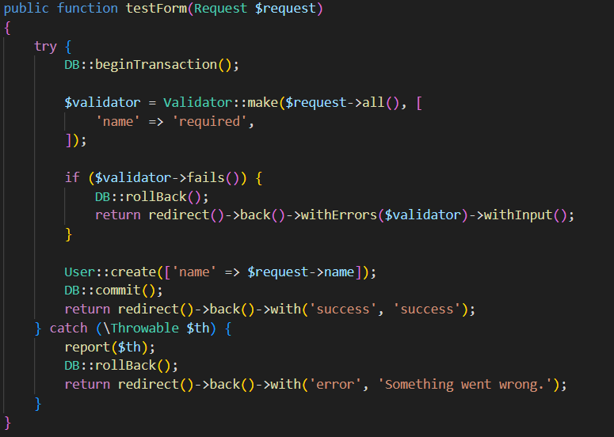

# Bug Report for Laravel 11

## Description

This repository is created to demonstrate an issue with Laravel 11 where database transactions interfere with validation error messages.

## Code Example

### 1. Routes

The routes used in this example are:
- `Route::get('/', function () { return view('welcome'); });`
- `Route::post('/test', [TestController::class, 'testForm'])->name('testForm');`

### 2. Controller

*Description: This image shows the controller code that includes `DB::beginTransaction();` and validation logic.*

### 3. Blade File

*Description: This image shows the Blade file used for the form.*

## Issue

When `DB::beginTransaction();` is placed above the validation code, the validation error messages do not display. The issue can be resolved in two ways:

### Screenshots

#### Issue (Code Not Working)

*Description: This image shows the code where validation error messages do not display when `DB::beginTransaction();` is used before validation.*

#### Solution 1

*Description: This image demonstrates the solution where adding `DB::rollBack();` before `return redirect()->back()->withErrors($validator)->withInput();` makes validation messages display correctly.*

#### Solution 2

*Description: This image shows the solution where moving `DB::beginTransaction();` after handling validation errors resolves the issue.*

## Additional Information

- Laravel Version: 11.15.0
- PHP Version: 8.2.0
- Database Driver & Version: MySQL 5.2.0
